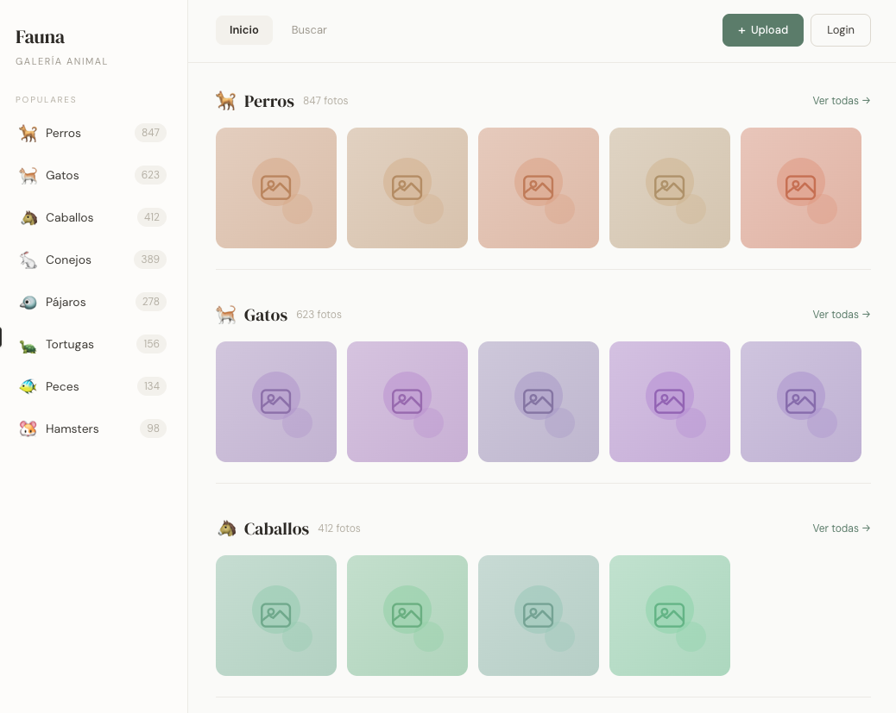
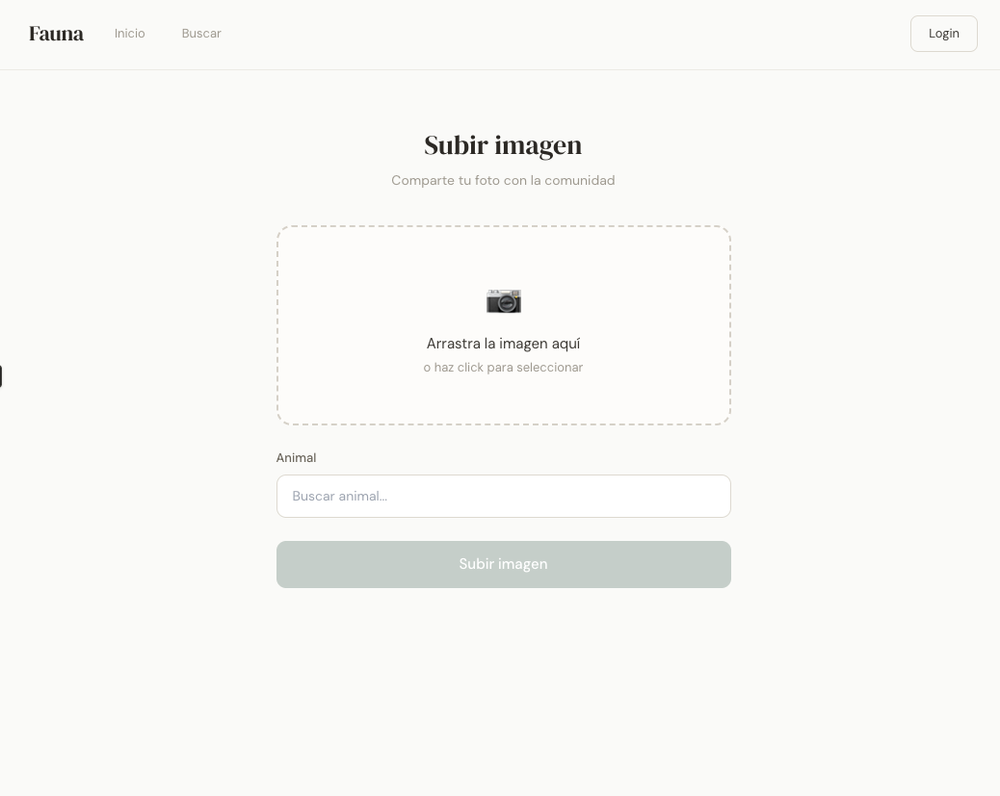
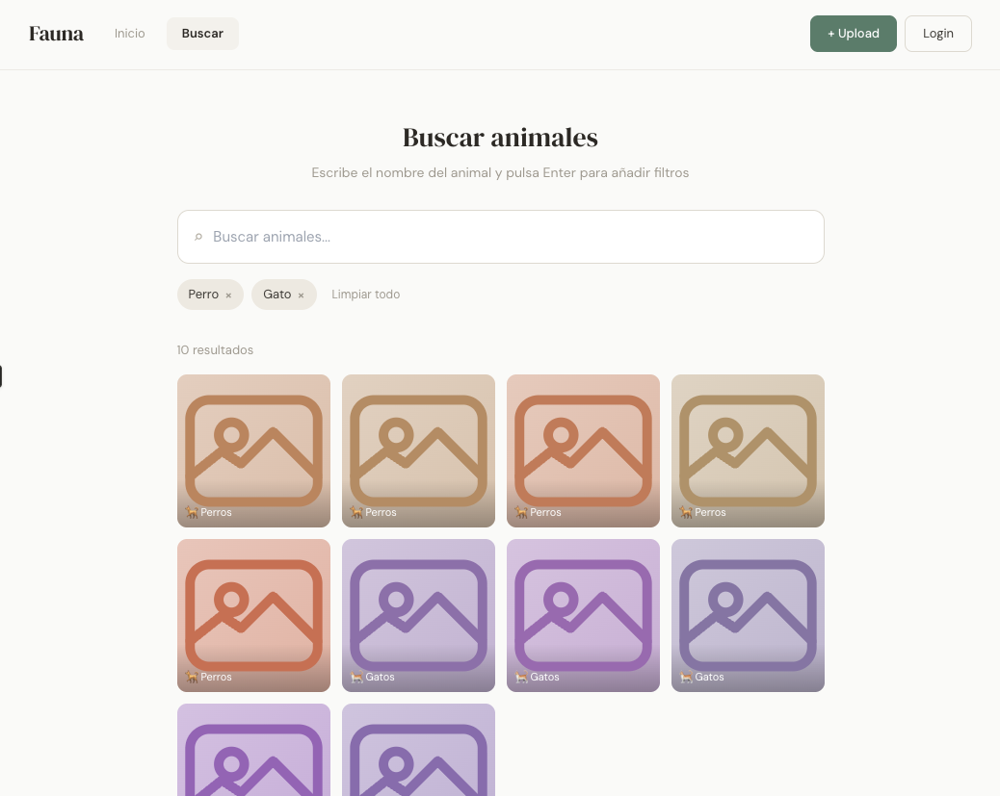

# Proyecto Final - Plataforma de fotos de animales

## 1. Idea de proyecto

Este proyecto consiste en una pequeña plataforma web donde los usuarios pueden subir y ver fotos de animales.

La idea es crear un espacio sencillo, parecido a un blog o a Pinterest, donde las personas que les gustan los animales puedan compartir fotos de forma casual. Cada foto estará asociada a un tipo de animal (por ejemplo: perro, gato, pájaro, reptil, etc.) para que sea más fácil organizar el contenido.

El sistema permitirá subir imágenes y clasificarlas por categoría de animal. Las categorías no estarán guardadas directamente en la base de datos, sino que se obtendrán desde una API externa. De esta forma se puede mantener una lista de animales más dinámica y actualizable.

El objetivo principal del proyecto es ofrecer una aplicación simple donde los usuarios puedan:

- Compartir fotos de animales.
- Ver fotos de otros usuarios.
- Filtrar o explorar las imágenes según el tipo de animal.

Este proyecto está dirigido principalmente a personas que disfrutan viendo fotos de animales y quieren compartirlas de manera rápida y sencilla sin necesidad de usar redes sociales complejas.

---

## 2. Requisitos funcionales

Los requisitos funcionales describen qué funcionalidades tendrá la aplicación y qué acciones podrá realizar el usuario o el sistema.

### Subida de imágenes

- El usuario podrá subir una foto de un animal desde su dispositivo.
- Al subir la foto deberá seleccionar el tipo de animal al que pertenece.

### Selección del tipo de animal

- La lista de animales disponibles se obtendrá desde una API externa.
- El usuario podrá elegir el animal desde un selector (dropdown o lista).

### Visualización de imágenes

- Los usuarios podrán ver una galería con todas las imágenes subidas.
- Cada imagen mostrará el tipo de animal al que pertenece.

### Filtrado por tipo de animal

- El usuario podrá ver solo las imágenes de un tipo de animal concreto.
- Por ejemplo: ver solo fotos de perros o solo fotos de gatos.

### Almacenamiento de datos

- Las imágenes subidas se guardarán en el servidor.
- La información de las fotos (ruta de la imagen, tipo de animal, fecha, etc.) se guardará en una base de datos MySQL.

### Navegación simple

- La aplicación tendrá una navegación sencilla para que cualquier usuario pueda explorar fácilmente las fotos.

---

## 3. Mockup gráfico

En esta sección se muestran los wireframes o mockups de las pantallas principales de la aplicación.

### Página principal / Galería de imágenes

Aquí se mostrará una galería con todas las fotos de animales que han subido los usuarios.

---

### Página para subir una foto

En esta pantalla el usuario podrá:

- Subir una imagen
- Seleccionar el tipo de animal desde un selector
- Publicar la foto

---

### Página de filtrado por animal

Esta pantalla permitirá ver solo las imágenes de un tipo de animal específico.

---

## 4. Arquitectura y tecnología

Para desarrollar este proyecto se utilizará una arquitectura web basada en **backend + base de datos + API externa**.

### Backend

El backend se desarrollará utilizando:

- **Laravel (PHP Framework)**

Laravel se utilizará para:

- Gestionar las rutas de la aplicación
- Controlar la lógica del servidor
- Gestionar la subida de imágenes
- Conectar con la base de datos
- Consumir la API externa de animales

Además, Laravel permite organizar el proyecto de forma clara usando controladores, modelos y vistas.

---

### Base de datos

Se utilizará:

- **MySQL**

La base de datos almacenará la información relacionada con las imágenes, por ejemplo:

- ID de la imagen
- Ruta del archivo
- Tipo de animal
- Fecha de subida

Las imágenes se guardarán en el servidor y la base de datos solo almacenará la referencia al archivo.

---

### API externa

El proyecto utilizará una **API externa de animales** para obtener la lista de tipos de animales disponibles.

Esto permitirá:

- Tener una lista dinámica de animales
- Evitar tener que mantener manualmente una tabla de animales

El backend de Laravel realizará las peticiones a la API y enviará los datos al frontend para mostrar el selector de animales.

---

### Frontend

El frontend estará compuesto por:

- **HTML**
- **CSS**
- **Blade (plantillas de Laravel)**

El frontend se encargará de:

- Mostrar la galería de imágenes
- Mostrar el formulario para subir fotos
- Mostrar los filtros por tipo de animal

---

### Estructura general de la aplicación

La aplicación tendrá la siguiente estructura:

- **Frontend**
  - Interfaz de usuario
  - Formularios
  - Galería de imágenes

- **Backend (Laravel)**
  - Controladores
  - Lógica de la aplicación
  - Conexión con la base de datos
  - Consumo de la API externa

- **Base de datos (MySQL)**
  - Almacenamiento de información de las imágenes

- **API externa**
  - Proporciona la lista de animales disponibles