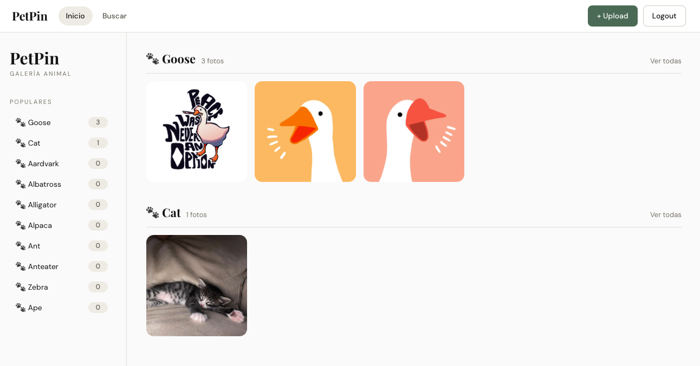
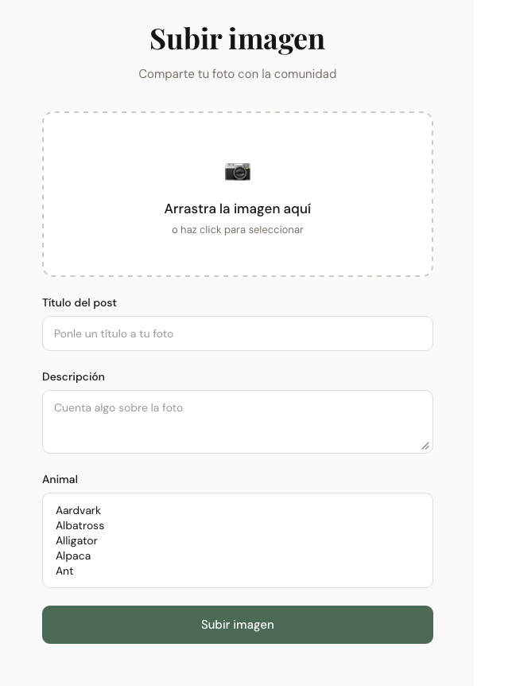
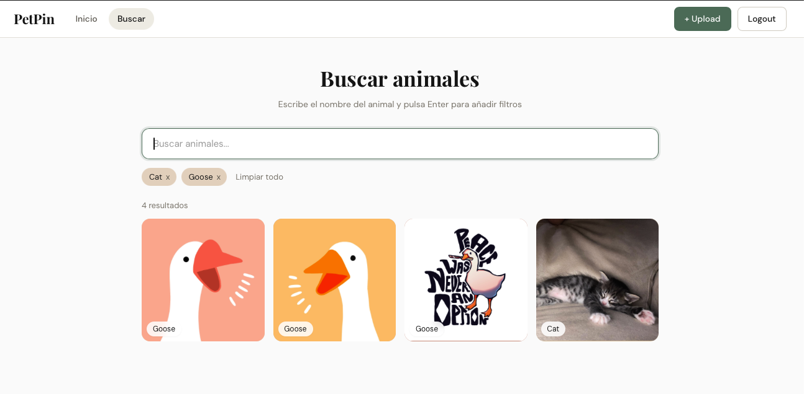
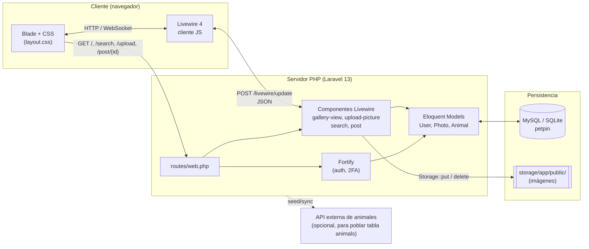
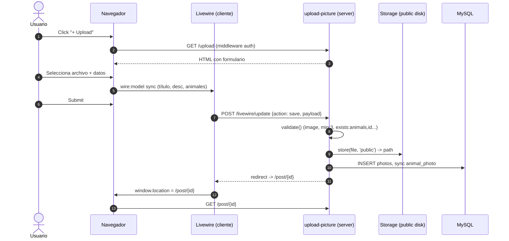
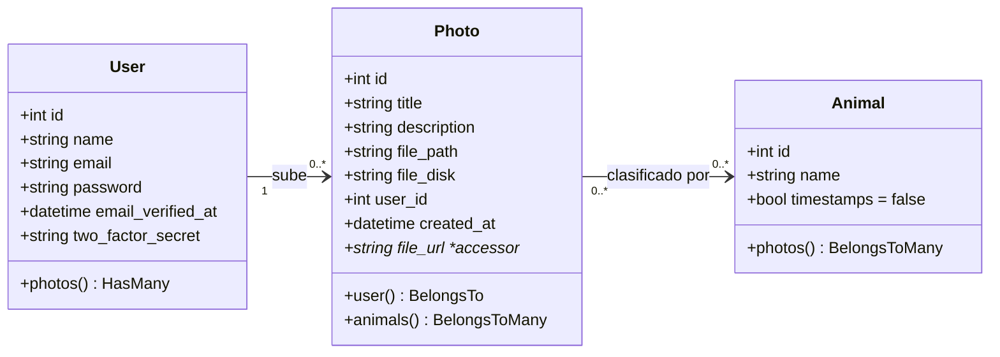
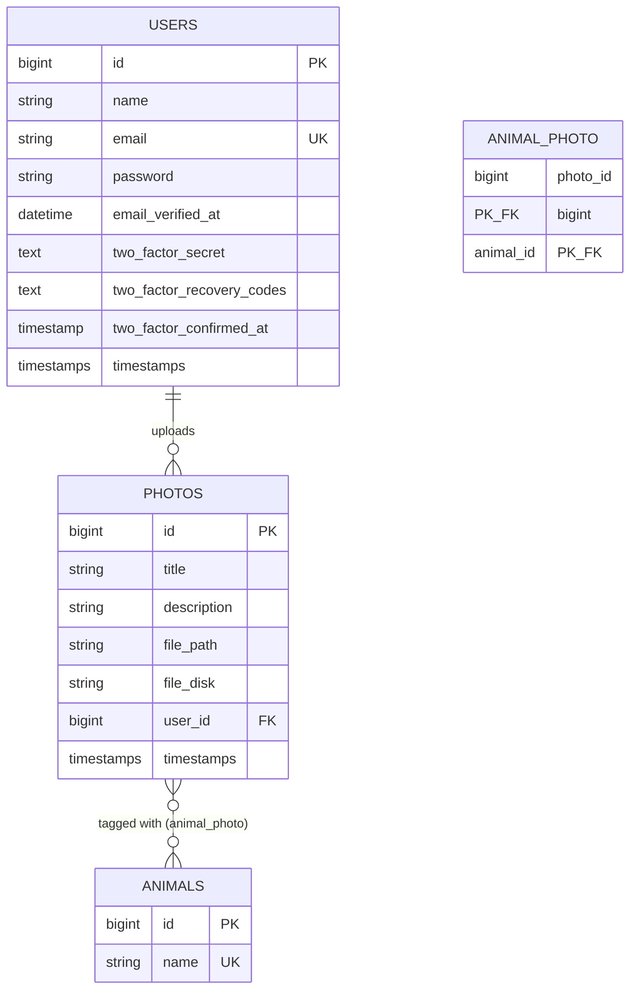

# PetPin - Plataforma de fotos de animales

## Enlace del proyecto

- Producción: https://proyectofinal.marcguma.com/

## 1. Idea de proyecto

Este proyecto consiste en una pequeña plataforma web donde los usuarios pueden subir y ver fotos de animales.

La idea es crear un espacio sencillo, parecido a un blog o a Pinterest, donde las personas que les gustan los animales puedan compartir fotos de forma casual. Cada foto estará asociada a uno o varios tipos de animal (por ejemplo: perro, gato, pájaro, reptil, etc.) para que sea más fácil organizar el contenido.

El sistema permite subir imágenes y clasificarlas por categoría de animal. Las categorías no se introducen libremente: el catálogo de animales es obtenido desde una API externa para mantener la lista actualizable.

El objetivo principal del proyecto es ofrecer una aplicación simple donde los usuarios puedan:

- Compartir fotos de animales.
- Ver fotos de otros usuarios.
- Filtrar o explorar las imágenes según el tipo de animal.

Este proyecto está dirigido principalmente a personas que disfrutan viendo fotos de animales y quieren compartirlas de manera rápida y sencilla sin necesidad de usar redes sociales complejas.

---

## 2. Funcionalidad

### Subida de imágenes
- El usuario autenticado puede subir una foto de un animal desde su dispositivo.
- En el formulario indica el **título**, la **descripción** y selecciona uno o varios **tipos de animal** asociados
- La imagen se guarda en disco (`storage/app/public/`) y la fila correspondiente se inserta en la tabla `photos`.

### Selección del tipo de animal
- La lista de animales disponibles se carga desde la tabla (`animals`).
- En la subida se muestra como `<select multiple>`; en la búsqueda como autocomplete con `<datalist>` que añade los seleccionados como elementos removibles.

### Visualización de imágenes (home)
- La página principal muestra los 10 animales con más fotos en una galería con secciones por especie (5 fotos por sección + enlace **Ver todas**).
- Sidebar lateral con la lista completa de "Populares" y conteo de fotos por animal; click en un animal filtra la galería principal a ese animal.

### Filtrado por tipo de animal (búsqueda)
- En `/search` el usuario puede combinar varios animales como filtros.
- Internamente se ejecuta una query con `whereHas('animals', ...)` sobre los IDs seleccionados.
- Los resultados se renderizan en un grid de tarjetas con la primera categoría visible como *tag*.

### Detalle de una foto
- En `/post/{id}` se muestra la imagen completa, su título, descripción y categorías.
- El **autor** de la foto ve un botón **Borrar post** que elimina la fila y el archivo físico (con `wire:confirm`).

### Autenticación
- Login, registro, recuperación de contraseña por **Laravel Fortify**.
- Las páginas `/upload` y `/dashboard` requieren sesión autenticada.

### Navegación
- Navbar global con logo, enlaces "Inicio" / "Buscar" y botones "+ Upload" / "Login" o "Logout".
- Los enlaces marcan estado activo según la ruta actual.

---

## 3. Mockup gráfico

En esta sección se muestran los wireframes o mockups de las pantallas principales de la aplicación.

### Página principal / Galería de imágenes

Aquí se muestra una galería con todas las fotos de animales que han subido los usuarios, agrupadas por especie y con sidebar de populares.



---

### Página para subir una foto

En esta pantalla el usuario puede:

- Subir una imagen (drag & drop o click)
- Añadir título y descripción
- Seleccionar uno o varios tipos de animal
- Publicar la foto



---

### Página de filtrado por animal

Esta pantalla permite combinar varios filtros y ver sólo las imágenes que pertenecen a los animales seleccionados.



---

## 4. Arquitectura y tecnología

### Stack

- **Backend**: Laravel 13 (PHP 8.3+)
- **UI dinámica**: Livewire 4 con componentes *single-file* (clase anónima + Blade en el mismo archivo)
- **Auth**: Laravel Fortify (login, registro)
- **Frontend**: Blade + CSS (`resources/css/layout.css`) para las páginas de producto; 
- **BBDD**: MySQL en producción (DB `petpin`); 

### Diagrama de arquitectura


```mermaid
flowchart LR
    subgraph Cliente["Cliente (navegador)"]
        UI["Blade + CSS<br/>(layout.css)"]
        LW["Livewire 4<br/>cliente JS"]
    end

    subgraph Servidor["Servidor PHP (Laravel 13)"]
        Router["routes/web.php"]
        LWComponents["Componentes Livewire<br/>gallery-view, upload-picture<br/>search, post"]
        Fortify["Fortify<br/>(auth, 2FA)"]
        Models["Eloquent Models<br/>User, Photo, Animal"]
    end

    subgraph Persistencia
        DB[("MySQL / SQLite<br/>petpin")]
        FS[["storage/app/public/<br/>(imágenes)"]]
    end

    APIExt["API externa de animales<br/>(opcional, para poblar tabla animals)"]

    UI <-->|"HTTP / WebSocket"| LW
    LW <-->|"POST /livewire/update<br/>JSON"| LWComponents
    UI -->|"GET /, /search, /upload, /post/{id}"| Router
    Router --> LWComponents
    Router --> Fortify
    LWComponents --> Models
    Fortify --> Models
    Models <--> DB
    LWComponents -->|"Storage::put / delete"| FS
    Servidor -. seed/sync .-> APIExt
```

### Flujo: subir una foto


```mermaid
sequenceDiagram
    autonumber
    actor U as Usuario
    participant N as Navegador
    participant L as Livewire (cliente)
    participant S as upload-picture (server)
    participant FS as Storage (public disk)
    participant DB as MySQL
    U->>N: Click "+ Upload"
    N->>S: GET /upload (middleware auth)
    S-->>N: HTML con formulario
    U->>N: Selecciona archivo + datos
    N->>L: wire:model sync (título, desc, animales)
    U->>N: Submit
    L->>S: POST /livewire/update {action: save, payload}
    S->>S: validate() (image, min:3, exists:animals,id...)
    S->>FS: store(file, 'public') -> path
    S->>DB: INSERT photos, sync animal_photo
    S-->>L: redirect -> /post/{id}
    L->>N: window.location = /post/{id}
    N->>S: GET /post/{id}
```

---

## 5. Modelo de datos

### Diagrama UML de clases


```mermaid
classDiagram
    direction LR
    class User {
        +int id
        +string name
        +string email
        +string password
        +datetime email_verified_at
        +string two_factor_secret
        +photos() HasMany
    }

    class Photo {
        +int id
        +string title
        +string description
        +string file_path
        +string file_disk
        +int user_id
        +datetime created_at
        +string file_url *accessor*
        +user() BelongsTo
        +animals() BelongsToMany
    }

    class Animal {
        +int id
        +string name
        +bool timestamps = false
        +photos() BelongsToMany
    }

    User "1" --> "0..*" Photo : sube
    Photo "0..*" --> "0..*" Animal : clasificado por
```

### Diagrama Entidad-Relación


```mermaid
erDiagram
    USERS ||--o{ PHOTOS : "uploads"
    PHOTOS }o--o{ ANIMALS : "tagged with (animal_photo)"

    USERS {
        bigint id PK
        string name
        string email UK
        string password
        datetime email_verified_at
        text two_factor_secret
        text two_factor_recovery_codes
        timestamp two_factor_confirmed_at
        timestamps timestamps
    }

    PHOTOS {
        bigint id PK
        string title
        string description
        string file_path
        string file_disk
        bigint user_id FK
        timestamps timestamps
    }

    ANIMALS {
        bigint id PK
        string name UK
    }

    ANIMAL_PHOTO {
        bigint photo_id PK_FK
        bigint animal_id PK_FK
    }
```

> El `animal_photo` tiene clave primaria compuesta `(photo_id, animal_id)` y `ON DELETE CASCADE` desde `photo_id`, de modo que al borrar una foto se eliminan automáticamente sus relaciones con animales.

---

## 6. Detalles de código relevantes

### Componentes Livewire *single-file*

Las cuatro pantallas de producto se implementan con el patrón nuevo de Livewire 4: clase anónima + Blade en el mismo archivo, ubicado en `resources/views/components/⚡<nombre>.blade.php`:

| Archivo | Propiedades reactivas | Acciones |
|---|---|---|
| `⚡gallery-view.blade.php` | `animalid` (`#[Url]`), `animal` | `setAnimal($id)`, `clearAnimal()`, `getPopular()` |
| `⚡upload-picture.blade.php` | `title`, `description`, `animalimage`, `animalType[]` | `save()` |
| `⚡search.blade.php` | `newtype`, `types[]` | `addnewtype()`, `deletetag($id)`, `clearTags()`, `search()` |
| `⚡post.blade.php` | `id`, `post` (`#[Locked]`) | `deletePost()` |

### Atributos de validación

`upload-picture` usa atributos PHP nativos sobre las propiedades:

```php
#[Validate('required|min:3')] public $title = '';
#[Validate(['animalType'=>'required', 'animalType.*'=>'required|min:1|exists:animals,id'])] public $animalType = [];
#[Validate('image')] public $animalimage;
#[Validate('required|min:10')] public $description = '';
```

### Modelos con atributos PHP (Laravel 13)

Los modelos usan los nuevos atributos `#[Fillable]` y `#[Hidden]` introducidos en Laravel 13 en lugar de las propiedades clásicas `protected $fillable`:

```php
#[Fillable(['title', 'description', 'file_path', 'file_disk', 'user_id'])]
#[Hidden(['file_path', 'file_disk'])]
class Photo extends Model { ... }
```

`Photo::file_url` es un *accessor* que envuelve `Storage::url($file_path)` para resolver dinámicamente la URL pública del archivo según el disco configurado.

### Filtrado por filtros combinados

La búsqueda combina varios animales con un único `whereHas` (no son ANDs encadenados, sino OR):

```php
Photo::with('animals')
    ->whereHas('animals', fn(Builder $q) => $q->whereIn('id', $this->types))
    ->latest()
    ->get();
```

### Borrado seguro de fotos

`post.deletePost()` aborta con 403 si el usuario actual no es el autor; sólo después borra la fila y el archivo físico:

```php
if ($this->post->user->id != Auth::id()) abort(403);
$this->post->delete();
Storage::disk($disk)->delete($path);
```

### CSS

Todo el diseño de las páginas de producto está en un único archivo CSS: `resources/css/layout.css` 

---

## 7. Dependencias

### PHP (`composer.json`)

| Paquete | Versión | Para qué |
|---|---|---|
| `php` | `^8.3` | Atributos de Eloquent (Laravel 13), `readonly` props |
| `laravel/framework` | `^13.7` | Framework base |
| `laravel/fortify` | `^1.34` | Login, registro, |
¡| `livewire/livewire` | `^4.1` | Componentes reactivos |

---

## 8. Endpoints del backend

### Páginas (HTTP)

| Método | Ruta | Middleware | Vista | Componente Livewire |
|---|---|---|---|---|
| GET | `/search` | - | `search.blade.php` | `<livewire:search/>` |
| GET | `/upload` | `auth` | `upload.blade.php` | `<livewire:upload-picture/>` |
| GET | `/post/{id}` | - | `post.blade.php` | `<livewire:post :id>` |
| POST | `/logout` | - | `AuthController@logout` | - |

> **Fortify** añade además los endpoints estándar de auth: `GET/POST /login`, `GET/POST /register`, `POST /logout`.


### Acciones por componente

#### `gallery-view` (home)

| Acción | Params | Efecto | Respuesta |
|---|---|---|---|
| `setAnimal` | `id: int` | Carga `Animal::findOrFail($id)` con sus fotos | HTML re-render con grid filtrado; URL `?animal={id}` (vía `#[Url]`) |
| `clearAnimal` | - | Resetea filtro | HTML re-render con galería completa |

#### `upload-picture` (subida)

| Acción | Params | Efecto | Respuesta |
|---|---|---|---|
| (sync) `wire:model` | `title`, `description`, `animalType[]` | Sincroniza estado | HTML parcial |
| (sync) `wire:model` | `animalimage` (file) | Sube a temporal vía `WithFileUploads` | URL temporal para preview |
| `save` | - | Valida -> `Storage::put` -> `INSERT photos` -> `sync animal_photo` | `redirect -> /post/{id}` |


#### `search` (búsqueda)

| Acción | Params | Efecto | Respuesta |
|---|---|---|---|
| `addnewtype` | - (lee `newtype`) | Busca animal por nombre exacto o prefijo único; añade a `types[]` 
| `deletetag` | `id: int` | Quita el animal del array `types` | HTML re-render con el tag eliminado |
| `clearTags` | - | Resetea filtros | HTML re-render vacío |

#### `post` (detalle)

| Acción | Params | Efecto | Respuesta |
|---|---|---|---|
| `deletePost` | - | Verifica autoría -> borra fila + archivo | `redirect -> /` |


